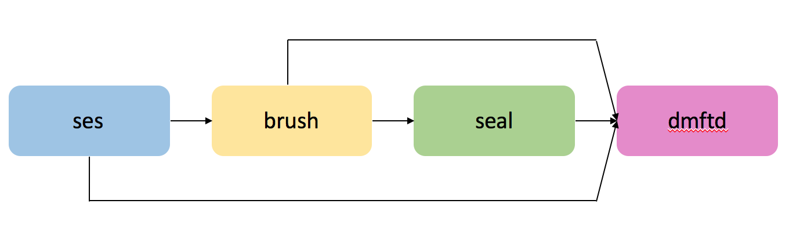
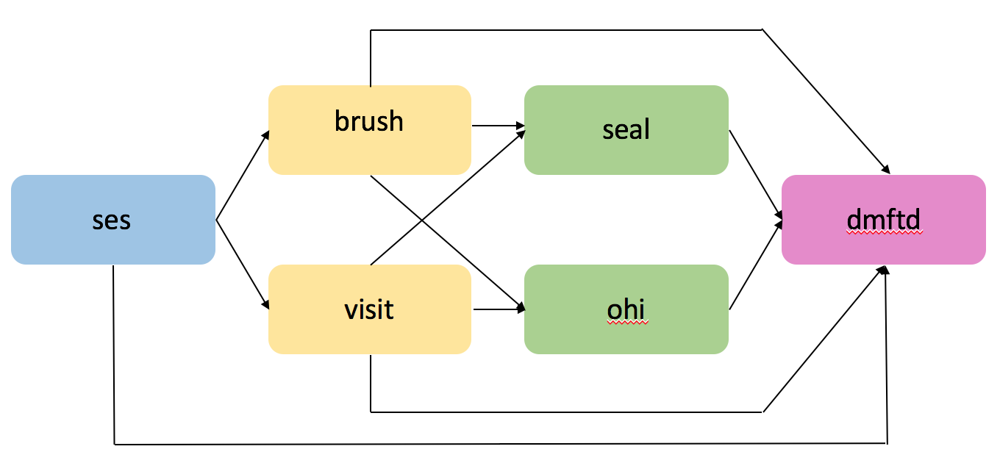

## Introduction  
`gmediation` package is developed to conduct causal mediation/path analysis for multiple mediators in two stages. The following diagram illustrates an application to estimate the path effects from an exposure X to the response Y through two first-stage mediators(m11, m12) and three second-stage mediators(m21, m22, m23). `gmediate` function in the package calculates all possible path effects depending on the model settings.  

  
  
## Install and load the package
### Installing the package
1. Install using the source file
  + Download the package source file "gmediation_1.0.tar.gz" from https://github.com/jichostat/gmediation and save it into your current R working directory
  + Type in the following lines in your R console
```
install.packages("gmediation_1.0.tar.gz", repos = NULL, type = "source")
```  
2. Installing directly from CRAN
  + Type in the following lines in your R console
```
install.packages("gmediation")
```  
For both cases, options in `install.packages` can be altered. For more information, see `help(install.packages)`.  

### Loading the package
Like other packages, load the package by typing
```
library(gmediation)
```
Now the functions in the `gmediation` package is ready to use.  

## Example
The example uses built-in data `dental`. The data automatically loads with the package, so there is no need to manually load the data using `data(dental)`. There are 11 variables in the dataset.  
```
VARIABLE DEFINITION

Varible Name | Type      | Definition
------------ | --------- | ---------------------------------------------------------------
ID           | character | permuted ID
dmftd        | factor    | binary. 1 if no decay, missing, or filled teeth; 0 otherwise 
ses          | factor    | binary. 1 if low social economic status; 0 otherwise
grpvlb       | factor    | binary. 1 if VLBW (very low birth weight); 0 otherwise
grpbpd       | factor    | binary. 1 if BPD (bronchopulmonary dysplasia); 0 otherwise
race         | factor    | binary. 1 if African American; 0 otherwise
SEX          | factor    | binary. 1 if male; 0 if female
brush        | factor    | binary. 1 if brushes at least twice per day; 0 otherwise
seal         | factor    | binary. 1 if has at least one dental sealant; 0 otherwise
visit        | factor    | binary. 1 if visits dentist twice per year; 0 otherwise
ohi          | numeric   | Oral Hygiene Index (between 0 and 3, higher worse)
------------------------------------------------------------------------------------------
```  
```
DENTAL DATA

  ID dmftd ses grpvlb grpbpd race SEX brush seal visit       ohi
1  1     1   1      0      0    1   0     1    0     0 1.5000000
2  2     1   0      0      0    0   1     0    0     1 1.1666667
3  3     1   1      0      0    0   0     0    0     1 0.8333333
4  4     1   1      0      1    1   1     0    0     1 1.3333333
5  5     1   1      0      0    1   1     1    0     0 3.0000000
6  6     0   1      0      1    1   0     1    0     1 3.0000000
```  
### Example 1
In this example we conduct a mediation/path analysis explaining the effect of `ses` on `dmftd` using one first-stage mediator `brush` and one second-stage mediator `seal`.  
{ width=90% }  

First, user needs to fit (specify) models for the response variable and each mediator. In this example, the following models are considered.

Response : dmftd ~ ses + brush + seal + grpvlb + grpbpd + race + SEX
2nd-stage mediator : seal ~ ses + brush + grpvlb + grpbpd + race + SEX
1st-stage mediator : brush ~ ses + grpvlb + grpbpd + race + SEX

`ses` is the exposure and `grpvlb, grpbpd, race, SEX` are covariates. Because `dmftd`,`seal`, and `brush` are all binary variables, a logistic model is fitted as below.  
```
model.y1 <- glm(dmftd ~ ses + grpvlb + grpbpd + race + SEX + brush + seal, family = binomial, data = dental)
model.m11 <- glm(brush ~ ses + grpvlb + grpbpd + race + SEX, family = binomial, data = dental)
model.m21 <- glm(seal ~ ses + grpvlb + grpbpd + race + SEX + brush, family = binomial, data = dental)
```
The models assigned to `model.y1`,`model.m11`, and `model.m21` will be read into the `gmediate` function.  
The arguments for `gmediate` to conduct the analysis is shown as below.  
```
single <- gmediate(data = dental, model.m1 = list(model.m11), model.m2 = list(model.m21) , model.y = model.y1, expos = c("ses", 1), ref = c("ses", c(0,1)), seed = 1234, bootsims = 100, cluster = NULL, decomp = 1, sig.level = 95, sens.par = c(0,0.9), refmult = 2)
single
names(single)
```  
Let's go over the arguments one by one.  

* `data = dental` : dental data is used as the original data  
* `model.m1 = list(model.m11)` : the model fit from the first-stage mediator is called in  
* `model.m2 = list(model.m21)` : the model fit from the second-stage mediator is called in  
* `expos = c("ses",1)` : variable `ses` is the exposure variable and `ses = 1` is exposed group / `ses = 0` is unexposed group  
* `ref = c("ses", c(0,1))` : variable `ses` is used to define the reference group. values `c(0,1)` of `ses` is used to derive a dataset to be used for the medation formula. In this example, we are using the entire dataset because `ses` only has values 0 and 1  
* `seed` : the seed used for bootstrap samples. If not specified, default value of 1234 will be used  
* `bootsims` : number of bootstrap samples to used for the confidence interval. If not specified, default of 500 bootstrap samples will be generated  
* `cluster` : if the data has clusters, user can use the cluster variable to get cluster bootstrap samples. That is, clusters are sampled with replacement. Then the resulting bootstrap sample contains the subjects in the selected (possibly duplicated) clusters. In this example, the cluster argument is not used, so standard bootstrap sampling of individuals is conducted  
* `decomp` : gmediate provides two choices of decomposition, characterized as an ordering to define path effects. In this example, the first decomposition is used  
* `sig.level` : the significance level used for confidence interval. If not specified, 95% significance level is used as default  
* `sens.par` : the sensitivity parameters for non-identifiable paths. If not specified, default sensitivity parameters `(-0.9, 0, 0.5, 0.9)` is used  
* `refmult` : the reference group multiplier.The number of reference group samples will be duplicated by this factor in the mediation formula computation to reduce Monte Carlo error.  
The results from gmediate are displayed below.  

```
Causal Mediation Analysis 
Exposure: ses 
Outcome: dmftd 
Sample Size Used: 205 
Number of Bootstrap Samples Used: 100 / 100 
Reference Group: ses = ( 0 1 ), Reference Group Multiplier (refmult) = 2 


-------------------------------
Mediation/Path Effect Estimates
-------------------------------

Individual Path Effects
       Path      Rho Estimate 95% CI Lower 95% CI Upper p-value
       --->        -   0.1681       0.0127       0.2873  0.0200
       ---> seal   -   0.0008      -0.0279       0.0129  0.9600
 brush --->        0  -0.0022      -0.0179       0.0131  0.7200
 brush --->      0.9  -0.0022      -0.0171       0.0121  0.7200
 brush ---> seal   0  -0.0022      -0.0070       0.0079  0.8800
 brush ---> seal 0.9  -0.0022      -0.0043       0.0101  0.8600


Total Effect
 Estimate 95% CI Lower 95% CI Upper p-value
   0.1645        0.003        0.291  0.0400


First Stage Mediators
 Mediator Estimate 95% CI Lower 95% CI Upper p-value
    brush  -0.0044      -0.0186       0.0129  0.8800


Second Stage Mediators
 Mediator Rho Estimate 95% CI Lower 95% CI Upper p-value
     seal 0.0  -0.0014      -0.0264       0.0205  0.9600
     seal 0.9  -0.0014      -0.0258       0.0190  0.9600


----------------------------------------------
Estimated Proportions of Total Effect Mediated
----------------------------------------------

Individual Path Effects
       Path      Rho Est Prop 95% CI Lower 95% CI Upper p-value
       --->        -   1.0219       0.6911       1.2704  0.0200
       ---> seal   -   0.0049      -0.2463       0.1927  1.0000
 brush --->        0  -0.0134      -0.3644       0.1327  0.7200
 brush --->      0.9  -0.0134      -0.2528       0.1329  0.7600
 brush ---> seal   0  -0.0134      -0.0590       0.1460  0.8800
 brush ---> seal 0.9  -0.0134      -0.0299       0.0881  0.8600


First Stage Mediators
 Mediator Est Prop 95% CI Lower 95% CI Upper p-value
    brush  -0.0267      -0.2238       0.2032  0.9200


Second Stage Mediators
 Mediator Rho Est Prop 95% CI Lower 95% CI Upper p-value
     seal 0.0  -0.0085      -0.1916       0.8815  0.9200
     seal 0.9  -0.0085      -0.2078       0.3159  1.0000
```
The results are divided into two parts. The first part shows the estimates of the path effects and the second part shows the proportion of each path effect to the total exposure effect mediated.  
`names(single)` will list all of the objects provided from the result of the gmediate function.  
```
[1] "indiv.path"       "total.path"       "first.path"       "second.path"      
[5] "prop.indiv.path"  "prop.first.path"  "prop.second.path" "boot.est"         
[9] "model.fit"
```
`gmediate` provides 9 output objecst. The objects `indiv.path`, `total.path`, `first.path`, `second.path`, `prop.indiv.path`,`prop.first.path`,`prop.second.path` refers to the result tables respectively. `boot.est` provides the path effect estimates from all bootstrap samples and `model.fit` provides the model fit from the complete case data.  

### Example 2
In this example we conduct a mediation/path analysis explaining the effect of `ses` on `dmftd` using two first-stage mediators `brush`, `visit` and two second-stage mediators `seal`, `ohi`. 
{ width=90% }  


Similar to example 1, user needs to specify models for each mediator and the final response variable.  
```
model.y2 <- glm(dmftd ~ ses + grpvlb + grpbpd + race + SEX + brush + visit + seal+ ohi, family = binomial, data = dental)
model.m11 <- glm(brush ~ ses + grpvlb + grpbpd + race + SEX, family = binomial, data = dental)
model.m12 <- glm(visit ~ ses + grpvlb + grpbpd + race + SEX, family = binomial, data = dental)
model.m21 <- glm(seal ~ ses + grpvlb + grpbpd + race + SEX + brush + visit, family = binomial, data = dental)
model.m22 <- glm(ohi ~ ses + grpvlb + grpbpd + race + SEX + brush + visit, family = gaussian, data = dental)
```
The user then calls the models in gmediate function as below. 
```
gmediate(data = dental, model.m1 = list(model.m11, model.m12), model.m2 = list(model.m21,model.m22) , model.y = model.y2, expos = c("ses", 1), ref = c("ses", c(0,1)), seed = 352, bootsims = 100, cluster = NULL, decomp = 2, sig.level = 95, sens.par = c(0,0.9), refmult = 2)
```
The meaning of the arguments is identical to example 1. In this example, we are calling in two first-stage mediators and two second-stage mediators, `seed` is changed to 352 and decomposition option 2 is used.
The results for this example are shown below.
```
Causal Mediation Analysis 
Exposure: ses 
Outcome: dmftd 
Sample Size Used: 205 
Number of Bootstrap Samples Used: 100 / 100 
Reference Group: ses = ( 0 1 ), Reference Group Multiplier (refmult) = 2 


-------------------------------
Mediation/Path Effect Estimates
-------------------------------

Individual Path Effects
       Path      Rho Estimate 95% CI Lower 95% CI Upper p-value
 visit --->  ohi   0   0.0118      -0.0177       0.0192  0.8600
 visit --->  ohi 0.9   0.0053      -0.0210       0.0232  0.8600
 visit ---> seal   0  -0.0127      -0.0164       0.0187  0.8600
 visit ---> seal 0.9  -0.0048      -0.0126       0.0174  0.7200
 visit --->        0   0.0224      -0.0083       0.0540  0.3400
 visit --->      0.9   0.0211      -0.0111       0.0493  0.3200
 brush --->  ohi   0  -0.0050      -0.0139       0.0152  0.9600
 brush --->  ohi 0.9   0.0024      -0.0123       0.0166  0.9000
 brush ---> seal   0   0.0112      -0.0149       0.0131  0.9000
 brush ---> seal 0.9  -0.0107      -0.0162       0.0130  0.9200
 brush --->        0  -0.0188      -0.0339       0.0164  0.9600
 brush --->      0.9  -0.0042      -0.0271       0.0178  0.9600
       --->  ohi   -   0.0506       0.0062       0.0993  0.0200
       ---> seal   -  -0.0003      -0.0229       0.0132  0.8400
       --->        -   0.1107      -0.0456       0.2555  0.2000


Total Effect
 Estimate 95% CI Lower 95% CI Upper p-value
     0.17       0.0016       0.3225  0.0600


First Stage Mediators
 Mediator Estimate 95% CI Lower 95% CI Upper p-value
    brush  -0.0125      -0.0287       0.0185  0.8600
    visit   0.0216      -0.0126       0.0535  0.1800


Second Stage Mediators
 Mediator Rho Estimate 95% CI Lower 95% CI Upper p-value
     seal 0.0  -0.0018      -0.0328       0.0234  0.9800
     seal 0.9  -0.0158      -0.0245       0.0229  0.9400
      ohi 0.0   0.0574       0.0016       0.1044  0.0400
      ohi 0.9   0.0582       0.0006       0.1064  0.0600


----------------------------------------------
Estimated Proportions of Total Effect Mediated
----------------------------------------------

Individual Path Effects
       Path      Rho Est Prop 95% CI Lower 95% CI Upper p-value
 visit --->  ohi   0   0.0694      -0.2722       0.1446  0.8800
 visit --->  ohi 0.9   0.0312      -0.2710       0.2806  0.8800
 visit ---> seal   0  -0.0747      -0.1573       0.1353  0.9200
 visit ---> seal 0.9  -0.0282      -0.1810       0.1965  0.7400
 visit --->        0   0.1318      -0.3165       0.5215  0.3600
 visit --->      0.9   0.1241      -0.2709       0.5055  0.3800
 brush --->  ohi   0  -0.0294      -0.2496       0.1976  0.9800
 brush --->  ohi 0.9   0.0141      -0.1146       0.3824  0.8800
 brush ---> seal   0   0.0659      -0.1270       0.4668  0.9600
 brush ---> seal 0.9  -0.0629      -0.2846       0.1112  0.8600
 brush --->        0  -0.1106      -0.2097       0.2341  0.9800
 brush --->      0.9  -0.0247      -0.2604       0.4228  0.9800
       --->  ohi   -   0.2976      -0.9312       1.2315  0.0800
       ---> seal   -  -0.0018      -0.1822       0.3457  0.8600
       --->        -   0.6512      -0.3042       2.7634  0.1400


First Stage Mediators
 Mediator Est Prop 95% CI Lower 95% CI Upper p-value
    brush  -0.0735      -0.1985       0.2567  0.8800
    visit   0.1271      -0.3579       0.5178  0.2400


Second Stage Mediators
 Mediator Rho Est Prop 95% CI Lower 95% CI Upper p-value
     seal 0.0  -0.0106      -0.2567       0.3766  1.0000
     seal 0.9  -0.0929      -0.3908       0.3232  0.8800
      ohi 0.0   0.3376      -0.9410       1.0136  0.1000
      ohi 0.9   0.3424      -0.6941       1.5551  0.1200
```
The interpretation of the results is similar to that of example 1.


